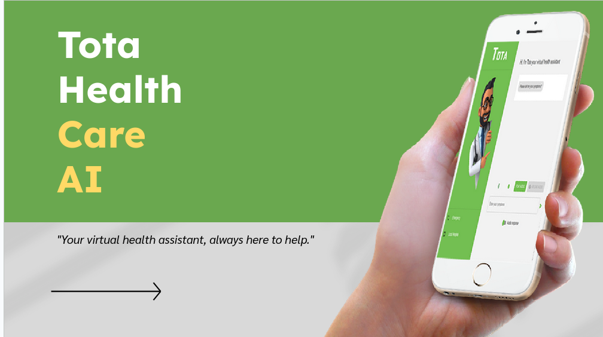

# Tota Healthcare AI

## Introduction
Tota  is a chat application that uses AI to provide virtual health assistance. It allows users to interact with a chatbot to ask health-related questions or seek medical advice. The application utilizes speech-to-text conversion and natural language processing to understand user queries and provide appropriate responses.

- Deployed Site: [Tota](https://tota.afristorm3.tech)

## Installation
1. Clone the repository: `git clone https://github.com/afristorm-3/Tota`
2. Navigate to the project directory: `cd Tota`
3. Install the dependencies: `npm install`

## Usage
1. Start the application: `npm start`
2. Open your web browser and navigate to: `http://localhost:3000`
3. Interact with the Tota  Health Assistant chatbot to ask health-related questions or seek medical advice.

## Contributing
We welcome contributions to the Tota Virtua Health Assistant project. To contribute, please follow these steps:

1. Fork the repository
2. Create a new branch: `git checkout -b feature/your-feature-name`
3. Make your changes and commit them: `git commit -m 'Add your feature'`
4. Push to the branch: `git push origin feature/your-feature-name`
5. Submit a pull request

## Author
- Backend Engineer: Temitope Owolabi 
- Frontend Engineer: Temitayo Alabeni
- LinkedIn: [Temitope Owolabi on LinkedIn](https://www.linkedin.com/in/temitopeowolabi/)
- LinkedIn: [Temitayo Alabeni on LinkedIn](https://www.linkedin.com/in/alabenitemitayo/)

## Licensing
The Tota Healthcare AI project is licensed under the [MIT License](LICENSE).

